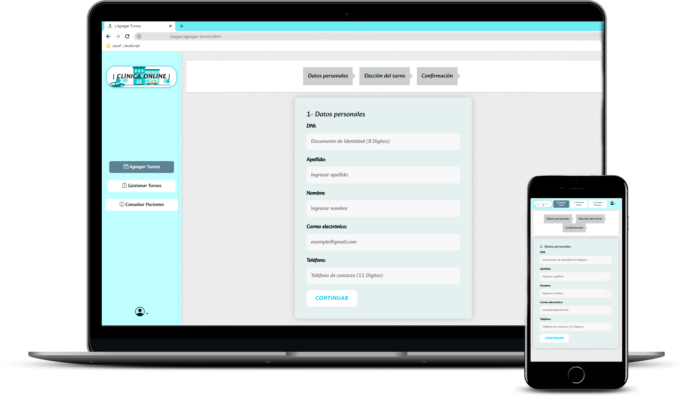

<div align="center">
<h1>🏥 | Medical Appointment Web Project | 🩺</h1>
<h2>This medical appointment management website has been developed as part of the final project for the JavaScript course at Coderhouse. This project is non-profit and is not responsible for any use that may be made of it.</h2>

[](https://github.com/Juudini/MedicalAppointmentWeb/blob/main/LICENSE.txt) [](https://app.netlify.com/sites/juudini-medical-appointment/deploys)

<h2><a href='https://apimocha.com/paciente/data'>API</a> | <a href='https://juudini-medical-appointment.netlify.app/'>WEB</a></h2>
</div>



<details>
  <summary>Índice</summary>
  <ol>
     <li>
      <a href="#project-description">Project Description</a>
     </li>
     <li>
      <a href="#instructions-for-use">Instructions for Use</a>
     </li>
     <li>
      <a href="#technologies-used">Technologies Used</a>
     </li>
     <li>
      <a href="#api">API</a></li>
     <li>
      <a href="#available-functions">Available functions</a>
     </li>
	   <li>
      <a href="#lighthouse">LightHouse</a>
     </li>
     <li>
      <a href="#feedback">Contributions</a>
     </li>
     <li>
      <a href="#license">License</a>
     </li>
  </ol>
</details>

[](README.es.md)

## Project Description

The website allows you to perform the following functions:

-   **Add patients:** Allows you to add new patients by entering their personal information and selecting their appointment slot.

-   **Manage appointments:** Allows you to delete appointments for registered patients. The system displays a table showing the scheduled

-   **Search patients:** Provides a search functionality to check if a patient is registered. The user can enter the patient's name, phone number, or any information about the patient or their appointment, and the system will display the corresponding results.

## Instructions for Use

#### Welcome to the repository!

1. Download or clone the repository to your local machine:

`git clone https://github.com/Juudini/ProyectoFinalJavascript.git
`

2. Open the project in your preferred development environment.

3. By default, the username and password have been set as **"admin"** for both fields.

    ```
       Username: admin
       Password: admin
    ```

You're all set! Now you can explore and use this repository.

Feel free to customize and enhance the project as needed.

Happy exploring and coding!

## Technologies Used

This final JavaScript project was developed using the following technologies:

The [Bootstrap](https://getbootstrap.com/)framework was used to develop the user interface quickly and efficiently.

JavaScript was used to implement the main functionality of the project.

The [API Mocha](https://apimocha.com/) was used to consume patient and appointment information

The integration of the [SweetAlert](https://sweetalert2.github.io/) library added to display interactive alerts and messages on the page.

Additionally, [Granim.js](https://sarcadass.github.io/granim.js/) has been used for customized backgrounds.

## API

Address: https://apimocha.com/paciente/

The available endpoints are:

-   GET `/data`: Returns patients with **mocked** data.

## Available functions

The page allows users to schedule appointments and make changes to the existing appointment list. Here are the available functions on this page:

#### Add Appointments

To schedule an appointment, it is necessary to register the patient's information. The "Add Appointments" page allows users to enter the patient's data, such as `dni` (ID number), `apellido` (last name), `nombre` (first name), `email`, and `teléfono` (phone number). Additionally, users can select the desired appointment details including the `área` (area), `día` (date), `hora` (time), and `obra social` (health insurance). After registering the information, the patient can be added to the list of scheduled appointments.

#### Manage Appointments

-   The **_Manage Appointments_** page displays the scheduled appointments in a table. Users can view key information for each appointment, including patient information, date, and time. This section allows users to have an overview of the scheduled appointments.

-   Additionally, it allows the cancellation of scheduled appointments. If a patient is unable to attend their appointment, the user can cancel it from this section.

-   In summary, this appointment page offers a practical and efficient solution for patient and appointment management.

#### Search Patients

rovides a search functionality to check if a patient is scheduled. Users can enter either the patient's name, phone number, last name, or any desired data, and the system will display the corresponding results.

## LightHouse

[](https://github.com/Juudini/ProyectoFinalDebandi)
[](https://github.com/Juudini/ProyectoFinalDebandi)
[](https://github.com/Juudini/ProyectoFinalDebandi)
[](https://github.com/Juudini/ProyectoFinalDebandi)

## Feedback

This project was created for the **final project** of the **JavaScript course at Coderhouse.** If you have any comments or suggestions, feel free to contact me.

## Contributions

Contributions are welcome! If you would like to improve this page or add new features, feel free to fork the repository and submit your proposals via pull requests.

## License

This projects is licensed under the [Licencia MIT](https://github.com/Juudini/MedicalAppointmentWeb/blob/main/LICENSE.txt). If you use this code, attribution is appreciated

## 🔗 Links

[](https://juandebandi.netlify.app/)
[](https://www.linkedin.com/in/juandebandi/)
</a>
<a href="mailto:juudinidev@gmail.com">

</a>
